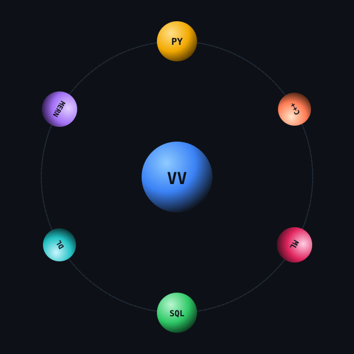
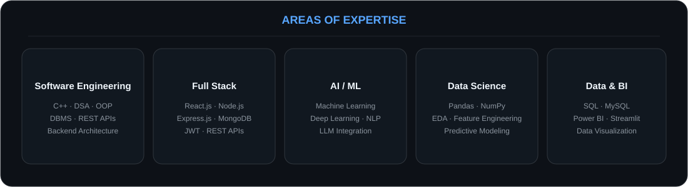
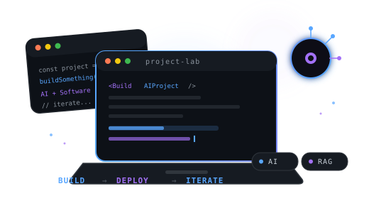
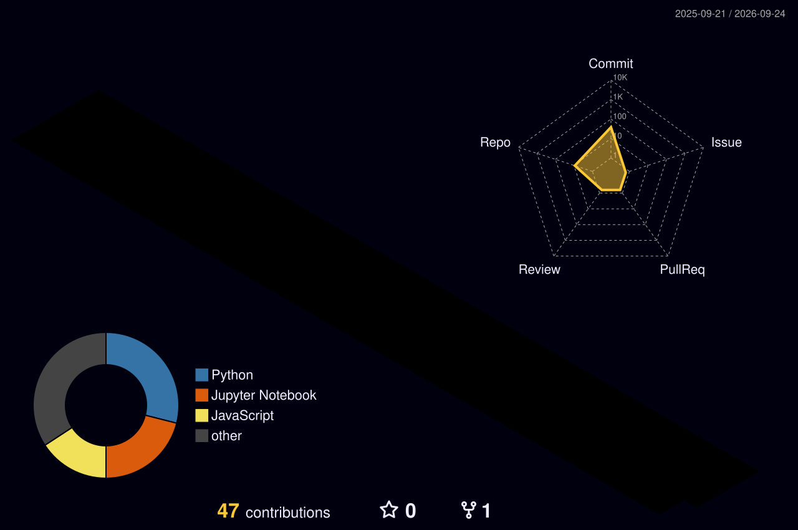
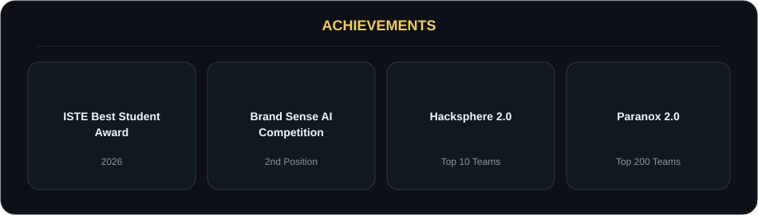
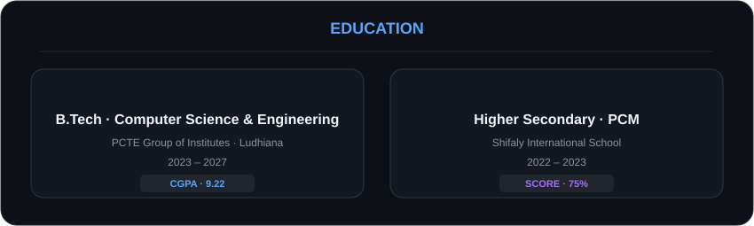

  

 

  
  
  

<table>
<tr>

<td align="center">

</td>

<td width="12"></td>

<td align="center">

</td>

<td width="12"></td>

<td align="center">

</td>

</tr>
</table>

---

 

## 🧠 About Me

<table width="100%">
<tr>

<td width="65%" valign="middle">

I'm a **Software Engineer at heart**, passionate about building scalable software, intelligent applications, and practical AI-powered systems.

My work spans **full-stack development, backend engineering, Machine Learning, Deep Learning, and Agentic AI** — from designing REST APIs and authentication systems to building LLM-powered applications and retrieval pipelines.

Currently pursuing **B.Tech in Computer Science & Engineering (2023–2027)** with a **9.22 CGPA**.

 

🔹 Strong foundation in **C++, DSA, OOP & DBMS**  
🔹 Full-stack development with **MERN**  
🔹 AI/ML development with **Python**  
🔹 Experience with **LLMs, RAG, LangChain & FAISS**  
🔹 Interested in building **production-ready AI software**

</td>

<td width="35%" align="center" valign="middle">

  

<b>Building at the intersection of</b>

 

Software × Data × AI

</td>

</tr>
</table>

 

  

 

---

 

<h2 align="center">🧩 Areas of Expertise</h2>

 

---

 

<h2 align="center">🛠️ Tech Arsenal</h2>

<h3>Languages & Development</h3>

  

<h3>Data Science · ML · Deep Learning</h3>

 

<h3>Generative AI · Agents · APIs</h3>

 

---

 

<h2 align="center">💼 Experience</h2>

<table width="100%">

<tr>

<td width="20%" valign="top">

<b>Jun 2026</b> 
<b>–</b> 
<b>Aug 2026</b>

</td>

<td valign="top">

<b>🟠 AI Engineer Intern — Coding Blocks School of Technology (CBSOT)</b>

 

Developed an **AI-powered academic research search application** combining retrieval, natural-language query processing, and LLM-based reasoning. Designed preprocessing and indexing workflows for searchable research content.

</td>

</tr>

<tr>
<td colspan="2"> </td>
</tr>

<tr>

<td width="20%" valign="top">

<b>Apr 2026</b> 
<b>–</b> 
<b>Jun 2026</b>

</td>

<td valign="top">

<b>🟢 Software Development Intern — Sacred Mind Infotech</b>

 

Built <i>SkillSwap</i>, a MERN-based peer-to-peer skill exchange platform. Developed responsive React.js frontend and Node.js/Express.js backend with MongoDB; implemented REST APIs for authentication, profiles, and skill-exchange workflows.

</td>

</tr>

<tr>
<td colspan="2"> </td>
</tr>

<tr>

<td width="20%" valign="top">

<b>Jun 2025</b> 
<b>–</b> 
<b>Aug 2025</b>

</td>

<td valign="top">

<b>🔵 Data Science Intern — Ducat India</b>

 

Built Python-based data processing and ML solutions using Pandas, NumPy & scikit-learn for real-world datasets; implemented reusable preprocessing workflows including missing-value handling, encoding, normalization, and feature engineering.

</td>

</tr>

<tr>
<td colspan="2"> </td>
</tr>

<tr>

<td width="20%" valign="top">

<b>Jul 2025</b> 
<b>–</b> 
<b>Dec 2025</b>

</td>

<td valign="top">

<b>🟡 Google Gemini Student Ambassador — Google</b>

 

Organized generative AI & software technology workshops for **100+ students**; collaborated with student teams on technical activities.

</td>

</tr>

</table>

 

---

 

<h2 align="center">🚀 Featured Projects</h2>

 

<table width="94%">

<tr>

<td width="50%" valign="top">

<h3>🎯 AI-Powered Interview Preparation Platform</h3>

<b>MERN · REST APIs · Gemini · JWT</b>

  

Full-stack AI platform that analyzes a <b>resume + job description</b> and generates personalized interview preparation and resume optimization.

  

&nbsp;

</td>

<td width="50%" valign="top">

<h3>📄 PaperPilot — AI Research Assistant</h3>

<b>Python · LangChain · FAISS · Sentence Transformers</b>

  

AI research assistant capable of <b>semantic search, summarization, comparison and filtering</b> across 50,000+ research papers.

  

</td>

</tr>

<tr>

<td width="50%" valign="top">

<h3>📉 Telco Churn & Segmentation</h3>

<b>Python · scikit-learn · Streamlit</b>

  

Machine-learning system combining <b>Random Forest classification + K-Means clustering</b> across 7,000+ customer records.

  

<b>~0.84 ROC-AUC · ~0.78 Churn Recall</b>

  

&nbsp;

</td>

<td width="50%" align="center" valign="middle">

</td>

</tr>

</table>

 

---

 

<h2 align="center">📊 GitHub Activity</h2>

 

  

  

<h3>🐍 Contribution Snake</h3>

 

---

 

<h2 align="center">🏆 Achievements</h2>

 

---

 

<h2 align="center">🎓 Education</h2>

 

---

 

<h2>📬 Let's Connect</h2>

  
    Interested in software engineering, AI/ML, data science, or building something together?
  

 

<table>
<tr>

<td align="center">

</td>

<td width="20"></td>

<td align="center">

</td>

<td width="20"></td>

<td align="center">

</td>

</tr>
</table>

 

<b>Open to Software Engineering · AI/ML · Data Science opportunities</b>

  

